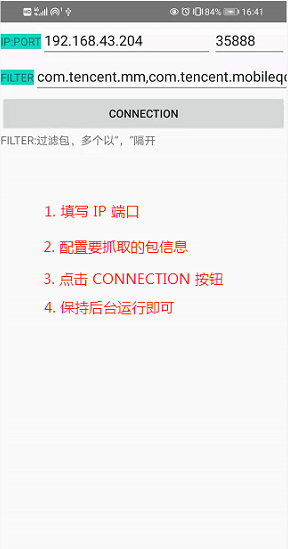
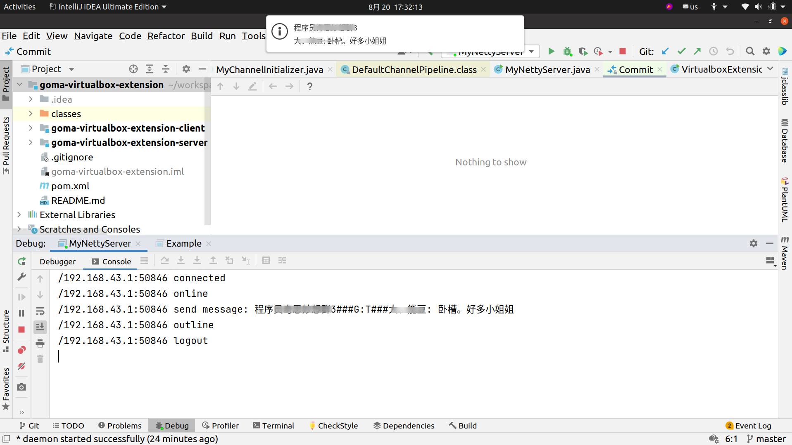

# android notification forwarder

## android 通知信息 转发

主要用于 Android 手机监听 notification 通知，提取通知内容发送给指定服务器。
主要配合 [goma-virtualbox-extension-server](https://github.com/Gomaxx/goma-virtualbox-extension#goma-virtualbox-extension-server) 使用

 

常用应用 Notification 包：

| APP | PKG |
| --- | --- |
| 微信 | com.tencent.mm |
| QQ  | com.tencent.mobileqq |
| 钉钉 | com.alibaba.android.rimet |

  
  
